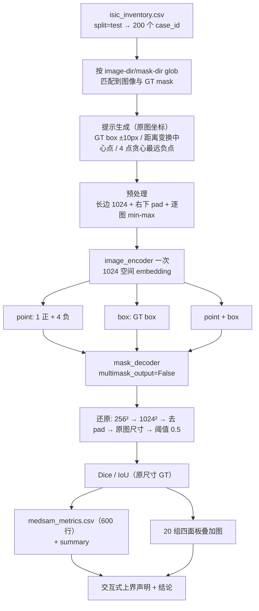

## 产品概述
在 ISIC 2018 test 200 张皮肤镜图像上，以固定权重 MedSAM（medsam_vit_b.pth）为分割模型，系统比较三类提示方式的分割效果：点提示（1 个前景中心点 + 4 个背景负点）、框提示（GT box）、点+框提示，输出 Dice 与 IoU 指标、逐例指标表与可视化叠加图，并明确该设置属于交互式上界（Oracle Prompt）协议。

## 核心特性
- 固定数据集：复用项目已有的 seed=42 划分，取 `isic_inventory.csv` 中 `split="test"` 的 200 例；文件路径改为由 `--image-dir/--mask-dir` 现场 glob 后按 case_id 匹配，保证本机与 OpenI 平台通用。
- 固定提示（均在原图坐标生成）：GT box 为真值 mask 外接框向四周各扩 10 像素并裁剪到图像边界；前景中心点为距离变换最深点（保证落在前景内）；4 个负点为背景距离图上贪心取最远点并用邻域抑制（半径 `max(int(0.1*min(H,W)), 20)`）得到的分散背景点。
- 固定输入：长边 resize 到 1024（保持长宽比）→ 右下 padding 到 1024×1024 → 逐图 min-max 归一化；推理后把 mask 还原到原图尺寸再评估。
- 固定推理：每张图只做 1 次图像编码，point / box / point+box 三种提示复用同一 embedding；`multimask_output=False`。
- 指标与产出：逐例 Dice、IoU（600 行长表 `medsam_metrics.csv`）+ 三模式汇总（均值±标准差、中位数、Dice<0.5 失败数、平均耗时）+ 20 组「提示/预测/真值」四面板叠加图。
- 结论声明：必须说明 GT box 及由真值推导的点提示属于交互式上界设置，不等于完全自动分割性能。

## 视觉效果
每组叠加图为 1×4 面板：① 原图 + GT 轮廓 + 提示（蓝框、绿色星形正点、红色叉形负点）；② 点提示预测 + GT 轮廓；③ 框提示预测 + GT 轮廓；④ 点+框提示预测 + GT 轮廓；每面板右上角标注该例 Dice 与 IoU，图名带序号与 case_id，便于验收归档。


## 技术栈
沿用项目现有栈，不引入新框架：
- Python + NumPy / OpenCV（图像与提示生成、距离变换）
- PyTorch 2.13（CPU 版，本地）/ CUDA（OpenI 平台）+ torchvision（`ResizeLongestSide` 依赖）
- `external/MedSAM/segment_anything`（SAM 源码，随仓库携带，`sys.path.insert` 引入，**不执行 `pip install -e .`**，规避 Windows 下 pycocotools/ninja 编译问题）
- pandas / matplotlib（CSV 与叠加图，沿用 `utf-8-sig` 与 `outputs/mX_taskY_*` 约定）

## 实现方案
整体为「单脚本离线批处理」：读清单取 test 200 例 → 逐例生成提示 → 预处理到 1024 → 一次编码、三次解码 → 还原到原图尺寸评估 → 增量写 CSV → 抽样出图。核心策略与取舍：

1. **一次编码、三次复用**：三种提示共享同一 `image_embedding`，编码次数从 600 降到 200，这是 CPU 上最大的加速点，也保证三种模式的输入完全一致、比较公平。
2. **绕过 `SamPredictor.set_image`**：该接口会施加 SAM 的 `pixel_mean/pixel_std` 归一化，与 MedSAM 训练口径不符；改为直接调用 `model.image_encoder(...)` + 手写 `mask_decoder`（与官方 `MedSAM_Inference.py` 一致）。
3. **坐标系统一**：提示在原图坐标生成，统一用 `ResizeLongestSide(1024).apply_boxes/apply_coords` 变换到 1024 空间；右下 padding 不产生坐标偏移。
4. **路径解耦**：CSV 只取 case_id 与 split，文件路径由目录参数现场匹配，使同一份代码在 OpenI（`c2net_context.dataset_path`）无需改路径前缀即可运行。
5. **中断可续**：每条结果即时 flush 落盘，`--resume` 按 `(case_id, prompt_mode)` 去重跳过，避免长时运行被中断后重跑。
6. **复杂度与瓶颈**：瓶颈在 ViT-B 图像编码器（1024×1024 输入）。CPU 约 10–40 s/例，200 例约 1–2.5 h；GPU 分钟级。解码器仅 600 次轻量前向，可忽略。显存/内存峰值约 1–2 GB（单张 1024×1024），无需批处理。

## 执行要点（已读源码核实，逐条规避返工）
- `sam_model_registry["vit_b"](checkpoint=...)` 默认 `image_size=1024`、`patch=16`；内部为 `load_state_dict(strict=True)`，若报 key 不匹配须**打印 missing/unexpected 后再决定是否回退**，禁止静默 `strict=False`。
- `apply_image` 要求 H×W×C 的 **uint8** numpy，内部走 torchvision PIL 双线性 resize（因此 torchvision 是硬依赖）。
- `apply_coords/apply_boxes` 内部用 `np.empty_like`：**坐标必须传 float32**，否则整数截断。
- `PromptEncoder` 内部已 `points + 0.5`、`boxes + 0.5`（Shift to center of pixel），**调用方绝不能再加 0.5**；`boxes` 传 `(1,4)` 即可；`points` 传 `(coords(1,N,2), labels(1,N))`，正样本 1、负样本 0。
- 坐标顺序：`apply_coords(coords, (H, W))`；裁剪去 padding 用 `prob[0, 0, :h, :w]`（h,w 为 resize 后未填充尺寸）；还原原图用 `cv2.resize(prob, (W, H), INTER_LINEAR)`（cv2 是宽在前）。
- 归一化顺序固定为：pad 0 → 在 1024×1024 整块上 min-max → 转 tensor（与官方实现一致）。
- 兜底处理：灰度图 repeat 成 3 通道、4 通道取前 3 通道；GT mask 与原图尺寸不一致时用 `INTER_NEAREST` 对齐；mask 为 0/255，按 >127 二值化。
- 平台版额外要求：`matplotlib.use('Agg')`、图标题用英文（平台缺中文字体会出现方框）、结尾 `upload_output()` 回传 `outputs/`。
- 日志与体量控制：逐例打印 `case_id + 三模式 Dice + 耗时`；不落盘概率图（仅 `--save-masks` 可选），避免输出目录膨胀。

## 架构设计



## 目录结构

```
f:/PythonProjects/cv_study_project/
├── scripts/
│   └── m4_task3/
│       └── medsam_prompt_isic.py          # [NEW] 本地版主脚本。负责：解析参数(--limit/--resume/--device/--num-threads/--make-vis/--save-masks)、
│                                          #       加载 inventory 取 test 200 例、按目录匹配路径、生成三种提示、预处理、一次编码三次解码、
│                                          #       还原原图尺寸评估 Dice/IoU、增量写 medsam_metrics.csv、抽样 20 例出四面板叠加图。
│                                          #       约束：sys.path.insert 引入 external/MedSAM；坐标一律 float32；不手动 +0.5；strict 加载并报告不匹配项。
├── scripts_openi/
│   └── medsam_prompt_isic_openi.py        # [NEW] 平台版脚本。复用本地版全部核心逻辑，仅替换入口：
│                                          #       c2net prepare/upload_output、dataset_path 下的 image-dir/mask-dir、matplotlib.use('Agg')、
│                                          #       英文图标题、权重路径（随代码上传或脚本内 wget，hf-mirror 备用）。
├── outputs/
│   └── m4_task3_medsam_prompt_isic/
│       ├── medsam_metrics.csv             # [NEW] 提交物：600 行长表(case_id×3 模式)
│       ├── medsam_metrics_summary.csv     # [NEW] 三模式 mean±std / median / Dice<0.5 计数 / 平均耗时
│       └── overlays/                      # [NEW] 提交物：overlay_01_<case_id>.png … overlay_20_<case_id>.png（每组 4 面板）
├── external/MedSAM/segment_anything/      # [已存在] 直接 sys.path 引入，不修改
└── ckpts/medsam_vit_b.pth                 # [已存在] 357.67 MB，作为 --checkpoint 默认值
```

## 关键代码结构

```python
# 提示生成（原图坐标，返回 float32）
def get_gt_box(mask: np.ndarray, expand: int = 10) -> np.ndarray | None: ...      # [x0,y0,x1,y1]，clip 到边界
def get_center_point(mask: np.ndarray) -> np.ndarray | None: ...                  # distanceTransform argmax，保证在前景内
def get_negative_points(mask: np.ndarray, k: int = 4) -> np.ndarray: ...          # 背景距离图贪心最远 + cv2.circle 邻域抑制

# 预处理与推理
def preprocess(img_rgb: np.ndarray, target: int = 1024) -> tuple[torch.Tensor, tuple[int,int], ResizeLongestSide]: ...
    # 长边 resize → 右下 pad 0 → 整块 min-max → (1,3,1024,1024)；返回 tensor/(h,w)/变换器

@torch.no_grad()
def medsam_predict(model, embedding, orig_hw, resized_hw, resize_tf,
                   box: np.ndarray | None = None,
                   points: np.ndarray | None = None,
                   labels: np.ndarray | None = None,
                   device: str = "cpu") -> tuple[np.ndarray, np.ndarray]:
    # prompt_encoder(points=(coords(1,N,2), labels(1,N)), boxes=(1,4), masks=None)
    # mask_decoder(..., multimask_output=False) → sigmoid → 插值 1024² → 去 pad → 还原 (W,H) → 阈值 0.5
```

CSV 列（长表，600 行）：`case_id, split, prompt_mode, orig_h, orig_w, gt_box, pos_point, neg_points, dice, iou, gt_area, pred_area, infer_time_sec, image_path, mask_path`

